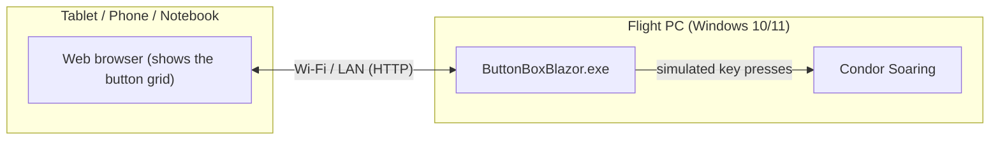

# Condor Button Box

A touch-friendly control panel for [Condor Soaring](https://www.condorsoaring.com/) that runs in your web browser. Instead of memorizing dozens of keyboard shortcuts for airbrakes, flaps, radio, LX instruments and more, you get a grid of labeled buttons you can tap on a tablet, phone, or a second PC while you fly.

This is an early **prototype**. It covers the default Condor Soaring key bindings only (see "Known limitations" below) and has not been tested with custom key mappings. Feedback on what works, what's missing, and what should be improved next is very welcome.


## How it works (architecture)

1. You start `ButtonBoxBlazor.exe` on the **same PC that runs Condor**. It starts a small local web server.
2. A **second device** (tablet, phone, or another notebook — Android, iOS, Windows, doesn't matter, as long as it has a modern web browser) connects to that web server **over your local network (Wi-Fi/LAN)**.
3. You tap buttons on the second device, and the matching keyboard button is triggered on the flight PC — exactly as if you had pressed that key yourself.



### Why not run it on the same device as Condor?

Condor runs in exclusive full-screen mode and needs the full attention of your screen, mouse and keyboard. A second screen (your tablet) lets you reach controls without alt-tabbing out of the simulation, covering part of your view, or fighting for input focus. Running the button grid in a browser on the same machine wouldn't give you that second, always-visible control surface.

## Requirements

- The flight PC runs **Windows 10 or 11**. It sends key presses using a Windows-only API, so it will **not** run on Linux or macOS.
- Both devices (flight PC and your tablet/phone/notebook) must be connected to the **same local network** (same Wi-Fi/router). The app does not work over the internet and does not need internet access.
- Any reasonably modern web browser on the second device (Chrome, Edge, Safari, Firefox, etc.).

## Getting started

### 1. Start the app on the flight PC

Double-click `ButtonBoxBlazor.exe`.

The first time it runs, **Windows Defender Firewall** will show a warning asking whether to allow the app to communicate on your network. You must confirm/allow this (at least for "Private networks") — otherwise your tablet won't be able to reach it.

A console window stays open while the app runs; keep it running in the background (it doesn't need to be in focus). Closing that window stops the server.

### 2. Find the flight PC's IP address

On the flight PC, open a Command Prompt (`cmd`) and run:

```
ipconfig
```

Look for the network adapter you're actually using (usually "Wireless LAN adapter Wi-Fi" or "Ethernet adapter") and note its **IPv4 Address**, e.g. `192.168.1.42`.

### 3. Open the app on your second device

On the tablet/phone/notebook, open a browser and go to:

```
http://<IP-address-from-step-2>:54738
```

For example:

```
http://192.168.1.42:54738
```

You should see the button grid. Add it to your home screen / bookmarks for quick access next time.

Works best on a **tablet in landscape orientation**. A smartphone works too, but its smaller screen isn't optimized for the button grid yet.

## Known limitations

- Only the **default Condor Soaring key bindings** are supported right now. If you've remapped controls in Condor's settings, the buttons in this app may not do what you expect.
- Only **keyboard key presses** are simulated. Gamepad/vJoy support is not planned, since it would make installation and setup considerably more complex for little gain.
- This is a first prototype aimed at gathering feedback.

## Feedback

This is a hobby project, free to use, with no revenue plans (maybe a donation option someday). Feedback is especially helpful on:

- Whether you're interested in this kind of tool at all.
- Whether the installation and setup (firewall warning, finding the IP, connecting the second device) worked for you.
- Which buttons/pages are missing, unnecessary, or confusingly labeled?
- Anything that felt unreliable (missed button presses, wrong key, etc.).
